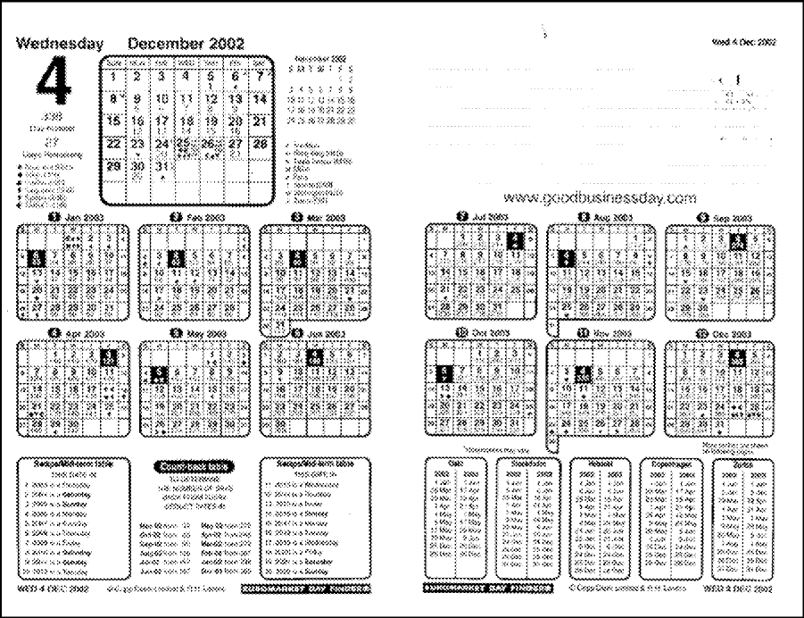

# FX Trading Basics

Foreign exchange is a business of exchanging one currency for another. This exchange can take two basic forms: an **outright** or a **swap**. 
When two parties simply exchange one currency for another the transaction is an **outright**. 
For example, if one party gives the other dollars for Euros, they have completed an _**outright**_ transaction. 
If this exchange takes place for immediate delivery, it is called a _**spot**_ transaction; if it takes place for forward delivery, it is called a _**forward**_.

Two parties can also agree to exchange and re-exchange one currency for another. For example, one party gives the other dollars for Euros for immediate delivery 
and simultaneously agrees to re-exchange Euros for dollars at a specified rate at some time in the future.
These transactions are called _**swaps**_.

## FX Spot

### WHAT IS AN OUTRIGHT?

An outright currency transaction involves two parties exchanging one currency for another.
The two parties must agree on the two currencies, the amount of one currency, the settlement date, and the exchange rate.
The amount of the second currency will be derived from a calculation involving the amount of the first currency and the exchange rate.

- __Outright rate of exchange/ spot:__ The amount of one unit of currency expressed in terms of the other.
- __Outright Transaction:__  The exchange of one currency for the other at the outright rate of exchange.

### VALUE DATES

The value date is the day the two parties actually exchange the two currencies. 
It is impractical, in most circumstances, for the value date and the trade date to be the same.
The forward value date is usually required to allow both parties time to arrange for payments which often occur in different time zones.

By market convention, foreign exchange trades settle two mutual business days (T + 2) after that trade date unless otherwise specified.
This is commonly referred to as value for spot. The spot exchange rate is the benchmark price the market uses to express the underlying value of the currency.
Rates for dates other than the spot are always calculated relative to the spot rate. 

Listed below are the various value dates available in the market-they are all determined relative to the deal date.
__Assume the deal date is Monday, December 12.__

| **Settlement**        | **Settlement/Value Date** | **Definition**                                                       |
| --------------------- | ------------------------- | -------------------------------------------------------------------- |
| Cash                  | December 12               | Deal Date                                                            |
| Value "Tomorrow Next" | December 13               | One Mutual Business Day after Deal Date#                             |
| Spot                  | December 14               | Two Mutual Business Day after Deal Date++                            |
| Forward Outright      | December 15 or later      | Threw Business Days or More After Deal Date; Always Longer than Spot |


`# The Settlement Date May Not Fall on a Day That is a National Holiday in Either Country.`

`++ Exception: Spot for the Canadian Dollar Against the USD is One Business Day Later. Assuming Today is Monday, December 12, Spot Would be December 13.`

#### QUESTIONS

Using the trader's calendar below, indicate the date on which each of these trades would settle. Assume you are at a New York bank dealing in currencies against the US dollar. Today is December 4th.



1. You do a trade in CAD for cash settlement => December 4
2. You do a spot CAD trade => December 5
3. You do a GBP trade for value tomorrow => December 5 
4. You do a spot GBP trade => December 6
5. You do a spot CHF trade => December 6

### CREDIT AND SETTLEMENT RISKS

Foreign Exchange contracts represent a Credit Risk between Lehman and the client. The risk is equal to the replacement cost of any deal in the event that the client cannot fulfill its obligations. For spot transactions, the exposure is for only the two days between the trade date and the value date. However, for forward contracts the exposure is greater because the time between the trade date and the value date is greater. For example, if Lehman contracted to buy USD/sell EUR one year forward at 1.0425 and the current forward rate is 1.0845, Lehman has a gain of over 4% of the face value of the contract. If the client cannot fulfill the contract, Lehman must replace the forward at the rate currently available and, therefore, stands to lose the 4% mark-to-market gain. Since the bank reports mark-to-market gains as income, client nonperformance has bottom line implications.

_Settlement Risk_ is another form of credit risk which can potentially be much greater. Each currency deal actually involves two settlements, since each currency settles in its home country. Since the exchange of currencies cannot be simultaneous due to time differences, each party is at risk for the time period between the two settlements. For example, assume you have sold JPY against the USD. The JPY will settle in Japan-your JPY account will be debited and the JPY delivered to the bank of the buyer-hours before your dollar account in New York is credited. Your risk is that you deliver JPY to the Japanese clearing, but the bank which owes you dollars in return for your JPY declares bankruptcy by the opening of business in NY. You have paid out the JPY but will not receive your dollars in exchange.

### EXCHANGE RATE QUOTATION TERMS

* The major currency pairs can be quoted in either European or Ameerican terms.
* Those that quote in number of US dollars per one unit of another currency is American. An example of this is EUR/USD which is quoted as the number of USD per one Euro.
* A currency quoted as the number of units of a specific currency per one USD is quoted in American terms. An example of this would be dollar-yen, which is quoted in yen per one USD. When rates are spoken the base currency comes first. It is imperative that you remember these conventions!

| **American Terms**         | **European Terms**         | **Other Major Cross Rates** |
| -------------------------- | -------------------------- | --------------------------- |
| EUR/USD - "Euro-Dollar"    | USD/JPY - "Dollar-Yen"     | EUR/NOK - "Euro-Nockie"     |
| AUD/USD - "Aussid-Dollar"  | USD/CAD - "Dollar-Cad"##   | EUR/SEK - "Euro-Stockie"    |
| NZD/USD - "Kiwi-Dollar"    | USD/CHF - "Dollar-Swiss"$  | USD/MEX - "Dollar-Mex"      |
| GBP/USD - "Sterling,Cable" | USD/SEK - "Dollar-Stockie" | USD/ZAR - "Dollar-Rand"     |
|                            | USD/NOK - "Dollar-Nockie"  | GBP/JPY - "Sterling-Yen"    |
|                            |                            | EUR/GBP - "Euro-Sterling"   |

The arithmetic way to express these quotations will always have the base currency in the denominator and the rates currency in the numerator. 
Do not allow this representation to confuse you when actually saying the currency pairs. This is simply how they would look mathematically. Examples are USD /EUR and JPY /USD being the nomenclature for arithmetic expression of Dollars per Euro and JPY per USD, respectively. The following will illuminate this point.

Since two currencies are involved, one has to be quoted in terms of the other. When we say that the exchange rate for the yen against the dollar is 123.50 yen,
we are valuing the dollar in terms of the yen-123.50 yen per dollar. The arithmetic expression tells you which currency is being quoted in terms of the yen.
In the case of the USD /EUR, the EUR is being quoted in terms of the USD.

The way the two currencies are referred to verbally will usually tell you which one is the base, since the base currency is usually stated first.
For example, when the two currencies involved are the US dollar and the yen, the relationship is called dollar-yen-meaning the number of yen per dollar.
This tells you that the dollar is the base and that the rate will be quoted in terms of yen per dollar.

> **Do not let the terminology confuse you; a "dollar-yen" rate is quoted as Yen per USD.**
> 

`##Also Known as the 'Loon'.`

`$ Sometimes Known as the 'Fondue Franc'`

* The currency in the numerator always states how much of that currency is required for one unit of the base currency.

  - U.S. terms: the dollar is in the numerator; for example, USD /GBP--giving the units of dollar per pound.
  - European Terms: the non-dollar currency is in the numerator; for example, JPY /USD, giving the units of yen per dollar.

    >            Numerator      Terms Currency
    >          ------------- = -----------------
    >           Denominator      Base Currency
    > 

#### QUESTIONS

* In many cases, you will see only the terms account; it is assumed you know the base. For example, if you see JPY124.25 you know that this means 124.25 Yen per $1.
 
1. GBP 1.5541: base <u>Sterling</u>: quoted in <u>US</u> terms.
2. CAD 1.5476: base <u>USD</u>: quoted in <u>European</u> terms.
3. AUD 0.5565: <u>AUD</u>: quoted in <u>US</u> terms.
4. EUR 1.0500: <u>EUR</u>: quoted in <u>US</u> terms. 

### RECIPROCAL QUOTATION TERMS (RATES)

* The method of quotation can be changed from US to European terms, or vice versa, simply by calculating the reciprocal of the rate. For example, Canadian dollars are usually quoted in European terms, that is, the number of Canadian dollars per one US dollar.

                   CAD/USD = 1.5672
                   
* However, at least for Canadian banks, you sometimes see it quoted in US terms. That is, the number of USD per CAD.
  
  To take the reciprocal: 
  
   >       1 / 1.5672    = 0.6381   =
   >         0.6381 USD per 1 CAD
   >

### EXCHANGE RATE MOVEMENTS

* The exchange rate is constantly changing, which means the value of one currency in terms of the other is in constant flux. When this relationship changes, the market speaks of one currency as strengthening or weakening vis-a-vis the second currency. For example, if the dollar strengthens, by definition, the other currency must have weakened.
* Whenever the base currency buys more of the terms currency or whenever there is an increase in the numerator, the base currency has strengthened and the terms currency has weakened. For example, if dollar-yen opened at 124.10 and closed at 124.60, you would say that the dollar strengthened since one dollar buys more yen at the close than it did at the open. In this case, the dollar closed higher or "up."
* Based on their outlook on a currency, traders will often take positions in that currency, buying it if they think it will strengthen and selling it if they think it will weaken.
  * Assume an FX trader bought one million dollar's worth of Swiss Francs at 1.4996 at the open because she thought Francs would strengthen over that day.
    However, her outlook for the day was wrong, and when she closed out her position by buying back the dollars at 1.5040 she experienced a $2,925.53 (CHF4,400) loss. 
    
     CHF loss:
     >           -$1,000,000.00  =  +CHF1,499,600 @ 1.4996
     >
     >           +$1.000.000.00  =  -CHF1.504.000 @ 1.5040
     >
     >           --------------     -----------------------
     >
     >                 -0-          -CHF4,400
     >
     >

  * The Swiss loss can then be converted into a dollar loss by dividing the Swiss loss by the ending exchange rate.
  
     > CHF 4400 / 1.5040 = $2925.53
     >


#### QUESTIONS

* Based on the rates given below, decide which currency strengthened and which one weakened, whether it closed up or down, and your profit/loss based on the position you took at the open.

_Remember: When the rate increases, the base strengthens, and the terms weakens._

Q1. Sterling opens at 1.5409 and closes at 1.5425.
The Dollar ______ and the Pound ______. Therefore, the Dollar closed (up/down) for the day, relative to the GBP. If you sold 1MM GBP and bought USD at the open and the reversed the trade at the close, your (profit/loss) would be ______ (currency and amount).

A1. The Dollar <u>weakened</u> and the Pound <u>strengthened</u>, since one Pound will buy more Dollars. The Dollar closed down for the day. You had a <u>loss</u> of </u>£1,037.28 or $1,600</u>.

```
    -£1,000,000 = +$1,540,900 @ 1.5409        -£1,000,000 @ 1.5409 = +$1,540,900

      +£998.963 = -$1,540,900 @ 1.5425        +£1,000,000 @ 1.5425 = -$1,542,500

    ----------------------------------        -----------------------------------

        -£1,037 =      0                             0             =     -$1,600
```

Q2. Dollar-Yen opens at 124.05 and closes at 123.50.
The Dollar ______ and the Yen ______.  Therefore, the Yen closed (up/ down) for the day, relative to the USD. If you sold USD 1MM at the open 
and reversed the position at the close, your (profit/loss) would be ______.

A2. The Dollar <u>weakened</u> and the <u>Yen</u> strengthened, since one Dollar will buy fewer Yen. The Yen closed up for the day. You had a <u>profit</u> of <u>¥550,000 or $4,453</u>.

```
   -$1,000,000 = +¥124,050,000 @ 124.05       -$1,000,000 @ 124.05 = +¥124,050,000

   +$1,004,453 = -¥124,050,000 @ 123.50       +$1,000,000 @ 123.50 = -¥123,500,000

   ----------------------------------        --------------------------------------

       +$4,453 =      0                             0             =      +¥550,000
``` 

Q3. CHF/USD opens at 1.5030 and closes at 1.5035.
The USD ______ and the Swiss Franc ______. Therefore, the Dollar closed (up/ down) for the day, relative to the CHF. If you sold CHF 10MM at the open 
and bought them back at the close, your (profit/loss) would be ______. 

A3. The Dollar <u>strengthened</u> and the <u>Swissie</u> weakened since one Dollar will buy more Swissie. The Dollar closed up for the day. You had a <u>profit</u> of <u>CHF3,327 or $2,213</u>.

```
    -CHF10,000,000 = +$6,653,360 @ 1.5030        -CHF10,000,000 @ 1.5030 = +$6,653,360 @ 1.5030

    +CHF10,003,327 = +$6,653,360 @ 1.5035        +CHF10,000,000 @ 1.5035 = +$6,651,147 @ 1.5035

    -------------------------------------        ----------------------------------------------

         +CHF3,327 =      0                             0                = +$2,213
```
